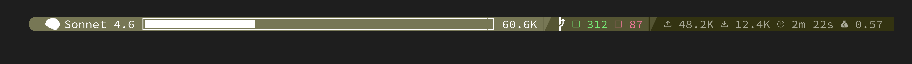

# ccline



A Powerline-themed status line renderer for [Claude Code](https://claude.ai/code). Reads session metadata from stdin as JSON and renders a styled status bar to stdout using ANSI true-color escape codes and Nerd Font glyphs.

The status bar displays three segments:
- **Model / context** — active model name, context window progress bar, and estimated token usage
- **Git diff** — lines added and removed in the current session
- **Token / cost summary** — total input/output tokens, API time, and estimated cost

## Requirements

Zig 0.15.2 or later.

**macOS (Homebrew):**
```sh
brew install zig
```

**Other systems:** download from [ziglang.org/download](https://ziglang.org/download/).

A terminal with [Nerd Font](https://www.nerdfonts.com/) support is required for the Powerline glyphs to render correctly. [Ghostty](https://ghostty.org/) is recommended — it ships with built-in Nerd Font glyph support and requires no additional font installation. Other terminals will need a [patched Nerd Font](https://www.nerdfonts.com/font-downloads) installed and configured.

## Build

```sh
zig build -Doptimize=ReleaseFast
```

The binary is written to `zig-out/bin/ccline`. Copy it somewhere on your `PATH`:

```sh
cp zig-out/bin/ccline ~/.local/bin/ccline
```

## Configure Claude Code

Add a `statusLine` entry to `~/.claude/settings.json` pointing to the installed binary:

```json
{
  "statusLine": {
    "type": "command",
    "command": "/Users/you/.local/bin/ccline"
  }
}
```

Replace the path with wherever you copied the binary.
